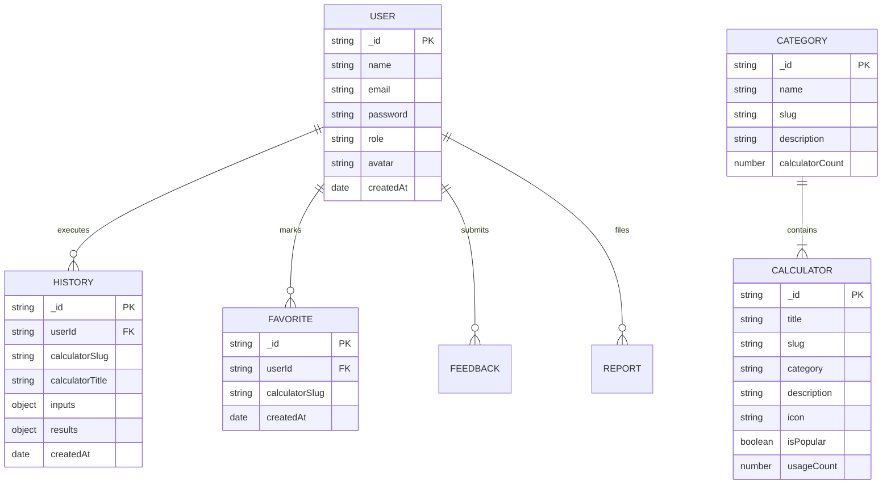

# CalcHub AI – Entity Relationship (ER) Diagram

```mermaid
erDiagram
    USER ||--o{ HISTORY : "executes"
    USER ||--o{ FAVORITE : "marks"
    USER ||--o{ FEEDBACK : "submits"
    USER ||--o{ REPORT : "files"
    CATEGORY ||--|{ CALCULATOR : "contains"

    USER {
        string _id PK
        string name
        string email
        string password
        string role
        string avatar
        date createdAt
    }

    CALCULATOR {
        string _id PK
        string title
        string slug
        string category
        string description
        string icon
        boolean isPopular
        number usageCount
    }

    CATEGORY {
        string _id PK
        string name
        string slug
        string description
        number calculatorCount
    }

    HISTORY {
        string _id PK
        string userId FK
        string calculatorSlug
        string calculatorTitle
        object inputs
        object results
        date createdAt
    }

    FAVORITE {
        string _id PK
        string userId FK
        string calculatorSlug
        date createdAt
    }
```
