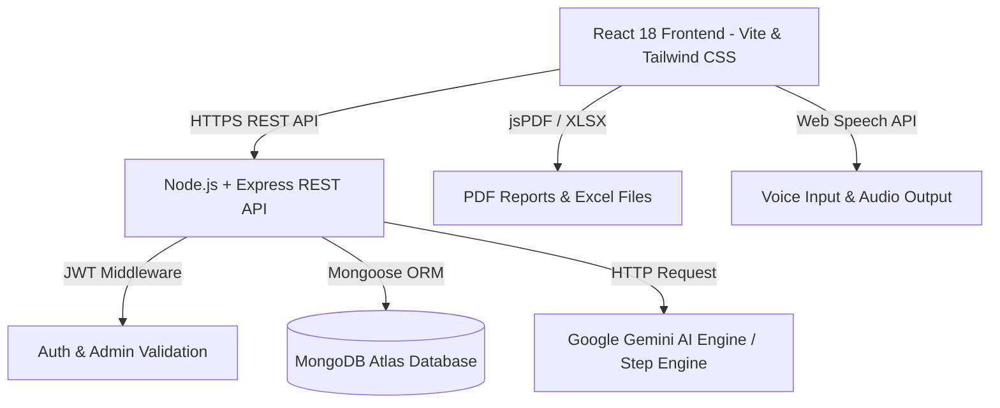

# CalcHub AI – System Architecture

```mermaid
graph TD
    Client[React 18 Frontend - Vite & Tailwind CSS] -->|HTTPS REST API| ExpressServer[Node.js + Express REST API]
    ExpressServer -->|JWT Middleware| AuthMiddleware[Auth & Admin Validation]
    ExpressServer -->|Mongoose ORM| MongoDatabase[(MongoDB Atlas Database)]
    ExpressServer -->|HTTP Request| GeminiAI[Google Gemini AI Engine / Step Engine]
    Client -->|jsPDF / XLSX| Exports[PDF Reports & Excel Files]
    Client -->|Web Speech API| SpeechSynthesis[Voice Input & Audio Output]
```
